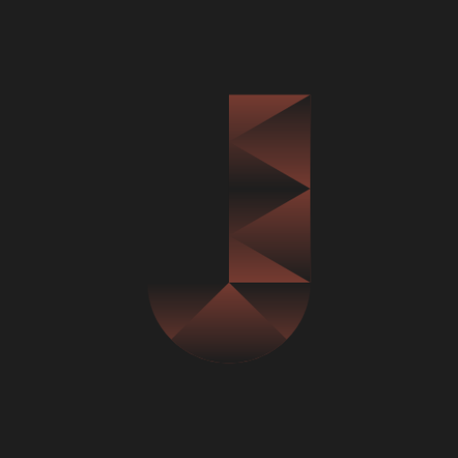
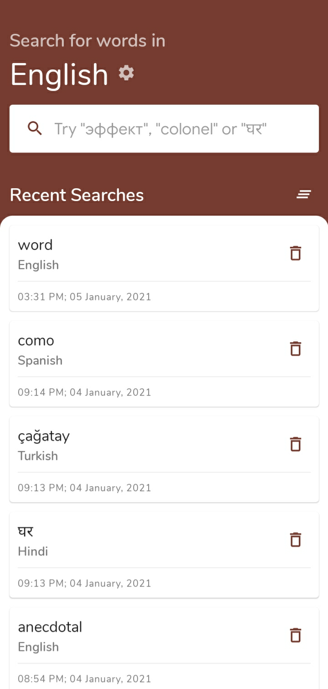
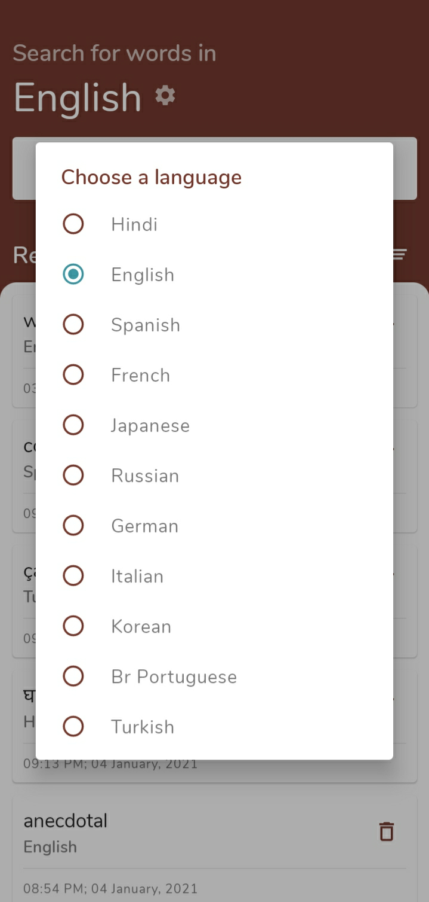
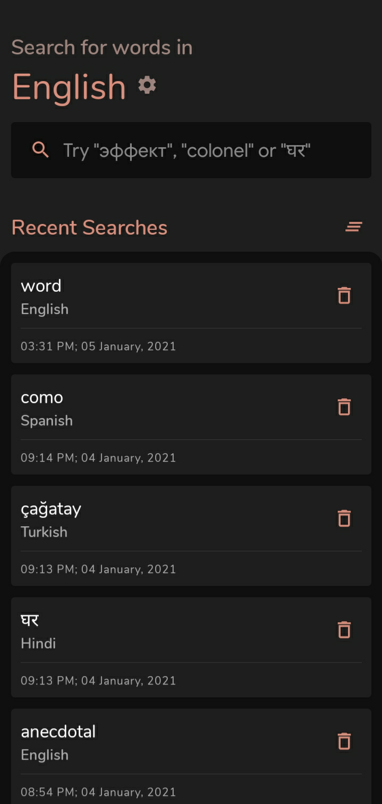
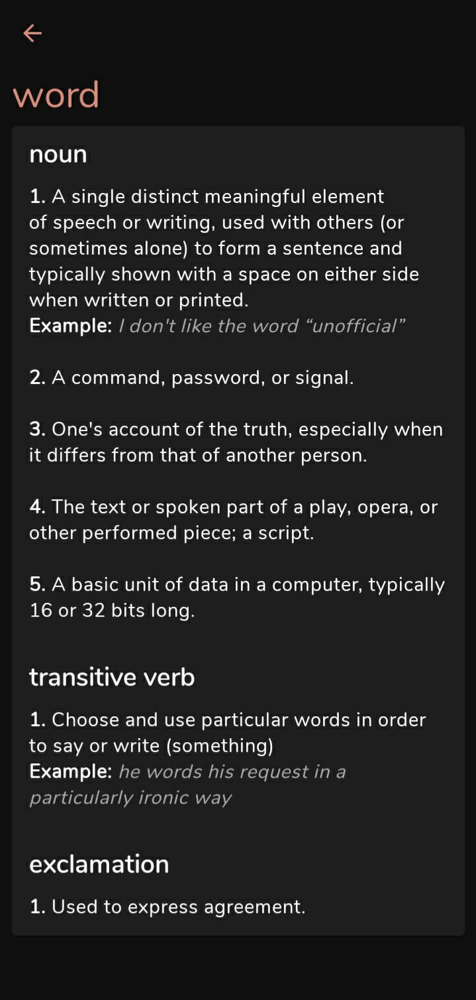
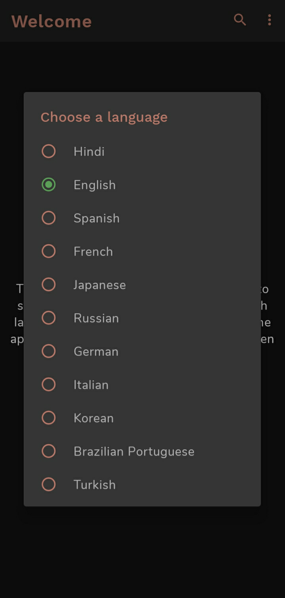

# JADA (Just Another Dictionary App)
(Licensed under the MIT License)

A simple free and open-source dictionary app that uses the API created by [Meet Developer](https://github.com/meetDeveloper) which you can check out [here](https://github.com/meetDeveloper/googleDictionaryAPI). This dictionary app uses that API to show definitions for the words entered by the user. It supports multiple languages and best of all it has dark mode.

**Keep in mind that JADA is not a translator app. Nothing does a better job of being a translator app than Google Translate. JADA provides you definitions of a word in the same language as the one the word is from.**

### Collaborators
* [Patricia B.](https://github.com/pborlongan): The designer of the app's new UI overhaul. Most of the design was designed by her, I am highly thankful to her for helping me out.

### Known Bugs/Issues

* [Mitigated] Searching for a word shows an empty screen, no error message no result. One such word is "Nope". The issue cannot be fixed as this is something wrong on the server's side, the server doesn't provide a definition for those words.

## Download
Currently the app is only available on Github releases due to some compilcated personal reasons. You can [download the app from Github releases here.](https://github.com/sbeve72/JADA/releases/latest)

## Multi-language Support

This dictionary supports multiple language as the API I am using does too. The languages supported are the following

* English
* Hindi
* Spanish
* French
* Japanese
* Russian
* German
* Italian
* Korean
* Brazilian Portuguese
* Turkish

*JADA does not support Arabic even though the API used does as there seems to be some issues with the Arabic side of the API. I have tested it with different Arabic words and it never returns an output. I will add support for Arabic if I figure out the reason it isn't behaving like it should.* ***I encourage people who know Arabic to help me figure out the issue***

## Versioning

The app uses a special blend of [Semantic Versioning](https://semver.org/#semantic-versioning-200) and some conventions decided by me to follow for this app since the guidelines for MAJOR in MAJOR.MINOR.PATCH are not compatible with Android Apps.
Everything is essentially the same except for a few key differences with MAJOR:
* MAJOR would be incremented if MINOR reaches 9
* It may also be incremented whenever the app stops supporting an old API level
* It may also be incremented upon any change that I consider major.

## What's special

The dictionary was made with clean architecture practices and ease of reading of the code in mind.

It uses Kotlin entirely and it uses Navigation Components and parts of the MVVM architecture pattern.

It uses Retrofit2 to access a webserver that uses the API mentioned above to retrieve information about the word entered by the user in the search bar and to show the results it uses a recycler view. It also uses Material Components throughout the app wherever possible.

This app can be used by absolute beginners as a way to learn some basic things like using ViewModels or LiveData or Material Components.

I have commented every piece of code that I believed was not part of common things you do in Android Development. All the logic and operations done by me that are not common practices and unique to this particular app were explained with comments.

There can be found many parts that could use some improvement since I by no means claim to be a perfectly skilled or experienced developer, in fact, relative to so many awesome developers out there, I am very much new. I would like to get suggestions to improve my code or app from other experiened developers.

## Screenshots

* ### Light Theme

* ### Dark Theme

